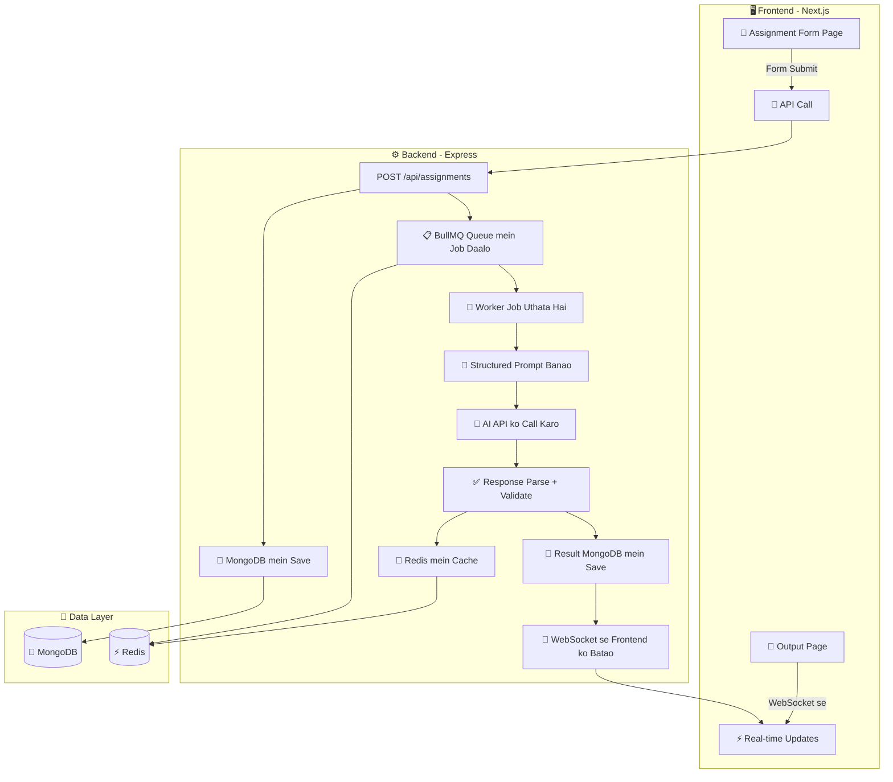
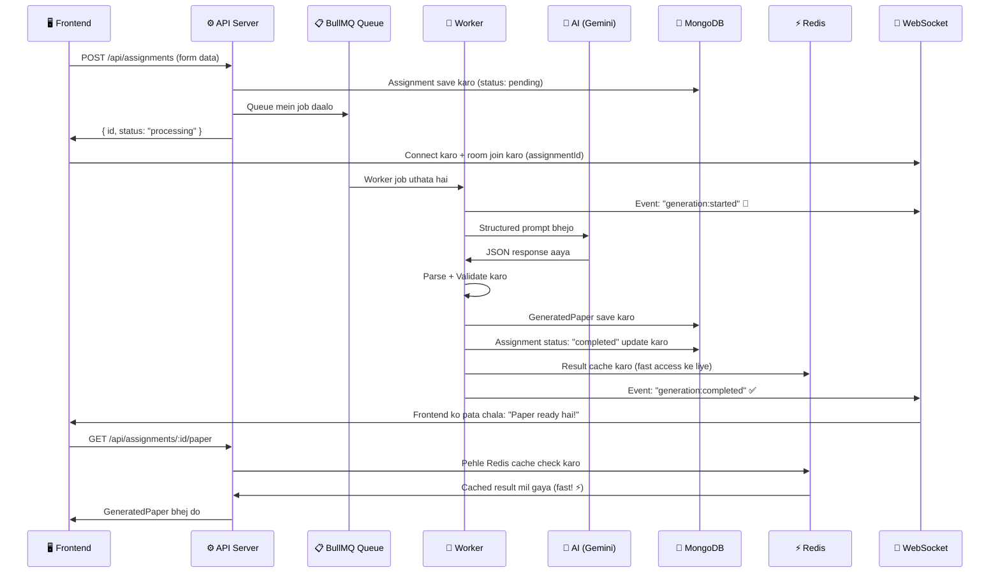

# VedaAI — AI Assessment Creator: Full Implementation Plan (Hinglish)

---

## 🎯 Yeh Project Kya Hai? (Bilkul Simple Language Mein)

Soch le — tu ek **AI-powered Question Paper Generator** bana raha hai **teachers ke liye**.

Matlab kya hoga?

```
Teacher ek form bharega → Backend mein job queue mein jayega → AI questions generate karega → 
Teacher ko real-time mein ek beautiful question paper dikhega
```

Jaise agar ek Physics teacher ko 10th class ka mid-term paper banana hai, toh woh:
1. Subject dalega: "Physics"
2. Topic dalega: "Thermodynamics"  
3. Bolega: "25 questions chahiye, 100 marks ka, 30% easy, 50% medium, 20% hard"
4. **Generate** button dabayega
5. **2-3 seconds mein** — ek poora structured question paper screen pe aa jayega! 🎉

> [!NOTE]
> Yeh koi simple "API call karo aur response dikhao" wala project nahi hai. Isme **job queue** hai, **WebSocket** hai, **caching** hai — production-grade system hai bhai!

---

## 🧠 Har Technology Kyun Use Ho Rahi Hai? (Tujhe Samajhna Zaroori Hai)

| Technology | Kyun Use Kar Rahe? | Simple Analogy |
|---|---|---|
| **Next.js** | React ka baap — routing, SSR, sab built-in milta hai | React bicycle hai, Next.js motorcycle hai |
| **TypeScript** | JavaScript mein types add karta hai — bugs pakadta hai code likhte waqt | Jaise spell-check — galti hone se pehle bata deta hai |
| **Zustand** | State management — saare components ke beech data share karne ke liye | Ek shared diary jismein saare components likh-padh sakte hain |
| **WebSocket (Socket.IO)** | Real-time 2-way communication — server se turant update milta hai | Phone call hai bhai — dono taraf se baat hoti hai, HTTP toh letter jaisa hai |
| **Express** | Node.js ka web framework — APIs banana isse aasaan nahi hota | Restaurant ka waiter — order leta hai, kitchen ko bhejta hai, khana laata hai |
| **MongoDB** | NoSQL database — flexible documents store karta hai | Filing cabinet jismein har folder ka format alag ho sakta hai |
| **Redis** | In-memory data store — RAM mein rehta hai, bohot fast hai | Sticky note monitor pe — jab baar-baar cheez chahiye toh yahan se lo |
| **BullMQ** | Job queue system — heavy kaam background mein karta hai | Bakery ki line — order do, token lo, baith ke wait karo, ready hone pe bula lenge |
| **LLM (GPT/Gemini/Claude)** | AI jo questions generate karega | Ek bohot intelligent assistant jo tere instructions padh ke kaam karta hai |

---

## 🏗️ System Architecture — Poora Flow Samajh Le



### Poora User Flow — Step by Step (Bahut Important!)

```
1.  Teacher app kholta hai → Assignment Creation Form dikhta hai
2.  Teacher form bharta hai: subject, topic, question types, difficulty, marks, due date
3.  Teacher "Generate" button dabata hai
4.  Frontend → POST request bhejta hai backend ko (/api/assignments)
5.  Backend kya karta hai:
    a. Assignment data MongoDB mein save karta hai (status: "pending")
    b. BullMQ queue mein ek JOB daal deta hai
    c. Frontend ko response bhejta hai: { assignmentId, status: "processing" }
6.  Frontend WebSocket se connect hota hai us assignmentId ke saath
7.  Frontend pe "Generating..." wala loading state dikhta hai
8.  BullMQ Worker (background mein) job uthata hai:
    a. Assignment data se ek structured PROMPT bana ta hai
    b. LLM API (Gemini/GPT) ko call karta hai us prompt ke saath
    c. AI ka response aata hai → JSON extract karta hai
    d. Zod se validate karta hai (marks sahi hain? count sahi hai?)
    e. MongoDB mein generated paper save karta hai
    f. Redis mein cache karta hai (fast retrieval ke liye)
    g. WebSocket ke through event emit karta hai: "generation-complete"
9.  Frontend ko WebSocket se event milta hai → "Paper ready hai!"
10. Frontend full result fetch karta hai aur screen pe render karta hai
11. Teacher ko ek beautiful, structured question paper dikhta hai! 🎉
12. Teacher PDF download kar sakta hai ya "Regenerate" kar sakta hai
```

> [!TIP]
> **Yeh flow interview mein bhi puchh sakte hain!** Isko dil se yaad kar le — "Explain the architecture of your project" — yeh flow bata dena.

---

## 📁 Project Structure — Files Kahan Kya Hoga

```
vedaai-assessment-creator/
│
├── client/                          # 🖥️ FRONTEND (Next.js)
│   ├── src/
│   │   ├── app/                     # Pages (Next.js App Router)
│   │   │   ├── layout.tsx           # Root layout — har page pe common stuff
│   │   │   ├── page.tsx             # Home page / Dashboard
│   │   │   ├── globals.css          # Global styles
│   │   │   ├── create/
│   │   │   │   └── page.tsx         # ⭐ Assignment Creation Form Page
│   │   │   └── assessment/
│   │   │       └── [id]/
│   │   │           └── page.tsx     # ⭐ Generated Paper Output Page
│   │   │
│   │   ├── components/
│   │   │   ├── ui/                  # 🧩 Reusable UI Components
│   │   │   │   ├── Button.tsx       # — Har jagah use hone wala button
│   │   │   │   ├── Input.tsx        # — Text input field
│   │   │   │   ├── Select.tsx       # — Dropdown select
│   │   │   │   ├── DatePicker.tsx   # — Date choose karne ka component
│   │   │   │   ├── FileUpload.tsx   # — PDF/file upload area
│   │   │   │   ├── Badge.tsx        # — "Easy", "Medium", "Hard" tags
│   │   │   │   ├── Card.tsx         # — Card container
│   │   │   │   ├── Loader.tsx       # — Loading spinner/skeleton
│   │   │   │   └── Toast.tsx        # — Notification popup
│   │   │   │
│   │   │   ├── forms/               # 📝 Form-specific Components
│   │   │   │   ├── AssignmentForm.tsx       # — Main form wrapper
│   │   │   │   ├── QuestionTypeSelector.tsx # — MCQ, Short Answer, etc. select
│   │   │   │   ├── DifficultySelector.tsx   # — Easy/Medium/Hard ratio set karo
│   │   │   │   └── MarksConfig.tsx          # — Total marks + per question marks
│   │   │   │
│   │   │   ├── output/              # 📄 Output Page Components
│   │   │   │   ├── QuestionPaper.tsx      # — Poora paper wrapper
│   │   │   │   ├── PaperHeader.tsx        # — Title, Subject, Date, Marks
│   │   │   │   ├── StudentInfoSection.tsx # — Name, Roll No, Section lines
│   │   │   │   ├── QuestionSection.tsx    # — Section A, B, C blocks
│   │   │   │   ├── QuestionItem.tsx       # — Individual question render
│   │   │   │   ├── DifficultyBadge.tsx    # — Easy=Green, Medium=Yellow, Hard=Red
│   │   │   │   └── ActionBar.tsx          # — Regenerate + Download PDF buttons
│   │   │   │
│   │   │   ├── layout/
│   │   │   │   ├── Navbar.tsx
│   │   │   │   └── Sidebar.tsx
│   │   │   └── shared/
│   │   │       ├── ProgressBar.tsx        # — Generation progress 30%...60%...
│   │   │       └── GeneratingOverlay.tsx  # — "AI is generating..." overlay
│   │   │
│   │   ├── store/                   # 🗃️ Zustand State Management
│   │   │   ├── useAssignmentStore.ts    # — Form data + result + status
│   │   │   └── useWebSocketStore.ts     # — Socket connection manage
│   │   │
│   │   ├── hooks/                   # 🪝 Custom React Hooks
│   │   │   ├── useWebSocket.ts          # — WebSocket connect/disconnect logic
│   │   │   └── useAssignment.ts         # — Assignment fetch/submit logic
│   │   │
│   │   ├── lib/                     # 🛠️ Utility Functions
│   │   │   ├── api.ts                   # — Axios/fetch wrapper for API calls
│   │   │   ├── validators.ts            # — Zod validation schemas
│   │   │   └── utils.ts                 # — Helper functions
│   │   │
│   │   └── types/                   # 📐 TypeScript Type Definitions
│   │       └── index.ts
│   │
│   ├── next.config.ts
│   ├── tsconfig.json
│   └── package.json
│
├── server/                          # ⚙️ BACKEND (Express)
│   ├── src/
│   │   ├── index.ts                 # 🚀 Entry point — Express + Socket.IO start
│   │   ├── config/
│   │   │   ├── db.ts                # — MongoDB connection setup
│   │   │   ├── redis.ts             # — Redis connection setup
│   │   │   └── env.ts               # — Environment variables load (dotenv)
│   │   │
│   │   ├── models/                  # 📊 Mongoose Schemas (Database ka structure)
│   │   │   ├── Assignment.ts        # — Assignment form data ka model
│   │   │   └── GeneratedPaper.ts    # — AI-generated paper ka model
│   │   │
│   │   ├── routes/
│   │   │   └── assignment.routes.ts # — All API routes define
│   │   │
│   │   ├── controllers/
│   │   │   └── assignment.controller.ts  # — Route handlers (logic)
│   │   │
│   │   ├── services/
│   │   │   ├── ai.service.ts        # — 🤖 LLM prompt building + API call
│   │   │   ├── parser.service.ts    # — AI response parse + validate
│   │   │   └── pdf.service.ts       # — PDF generate (bonus feature)
│   │   │
│   │   ├── jobs/
│   │   │   ├── queue.ts             # — 📋 BullMQ queue define
│   │   │   └── worker.ts           # — 👷 BullMQ worker (job process karta hai)
│   │   │
│   │   ├── websocket/
│   │   │   └── socket.ts           # — 📡 WebSocket event handlers
│   │   │
│   │   ├── middleware/
│   │   │   ├── errorHandler.ts     # — Global error handling
│   │   │   └── validate.ts         # — Request body validation
│   │   │
│   │   └── types/
│   │       └── index.ts
│   │
│   ├── tsconfig.json
│   └── package.json
│
├── .gitignore
├── .env.example                     # — Sab API keys ka template
└── README.md                        # — Project documentation
```

> [!TIP]
> **Har file ka ek clear kaam hai.** Isse code clean rehta hai aur interviewer ko bhi lagta hai ki tu organized developer hai. Isse **"Separation of Concerns"** bolte hain.

---

## 📊 Database Schemas — MongoDB Mein Kya Store Hoga

### Collection 1: `assignments` — Teacher Ka Form Data

```typescript
// Jab teacher form bharke submit karta hai, yeh data save hota hai

{
  _id: "abc123",                         // MongoDB auto ID
  title: "Physics Mid-Term 2024",        // Paper ka title
  subject: "Physics",                    // Subject name
  topic: "Thermodynamics",              // Specific topic (optional)
  gradeLevel: "Class 10",               // Kis class ke liye
  dueDate: "2024-04-15",                // Due date
  
  questionTypes: ["mcq", "short_answer", "long_answer"],  // Kaunse type ke questions
  numberOfQuestions: 25,                  // Kitne questions chahiye
  totalMarks: 100,                       // Total marks
  
  difficultyDistribution: {
    easy: 30,                            // 30% easy questions
    medium: 50,                          // 50% medium
    hard: 20                             // 20% hard
  },
  
  additionalInstructions: "Focus on practical applications",  // Extra instructions
  uploadedFileUrl: null,                 // Agar PDF upload kiya toh uska URL
  
  status: "pending",                     // pending → processing → completed / failed
  generatedPaperId: null,               // Jab paper ban jayega toh yeh fill hoga
  
  createdAt: "2024-03-20T10:00:00Z",
  updatedAt: "2024-03-20T10:00:00Z"
}
```

### Collection 2: `generated_papers` — AI Ne Jo Paper Banaya

```typescript
// AI generate karke jo output deta hai, woh parse hoke yahan save hota hai

{
  _id: "xyz789",
  assignmentId: "abc123",               // Kis assignment ke liye generate hua
  
  title: "Physics Mid-Term Examination 2024",
  subject: "Physics",
  totalMarks: 100,
  duration: "3 Hours",
  
  instructions: [                        // General paper instructions
    "All questions are compulsory.",
    "Write neat and clean.",
    "Marks are indicated against each question."
  ],
  
  sections: [
    {
      sectionLabel: "A",
      title: "Section A - Multiple Choice Questions",
      instructions: "Choose the correct option. Each question carries 1 mark.",
      questions: [
        {
          questionNumber: 1,
          text: "Which law of thermodynamics states that energy cannot be created or destroyed?",
          type: "mcq",
          difficulty: "easy",            // 🟢 Easy
          marks: 1,
          options: [
            "A) Zeroth Law",
            "B) First Law",              // ✅ Correct
            "C) Second Law",
            "D) Third Law"
          ]
        },
        {
          questionNumber: 2,
          text: "The SI unit of entropy is:",
          type: "mcq",
          difficulty: "medium",          // 🟡 Medium
          marks: 1,
          options: [
            "A) J/mol",
            "B) J/K",                    // ✅ Correct
            "C) K/J",
            "D) mol/K"
          ]
        }
        // ... aur questions
      ]
    },
    {
      sectionLabel: "B",
      title: "Section B - Short Answer Questions",
      instructions: "Answer in 2-3 sentences. Each question carries 3 marks.",
      questions: [
        {
          questionNumber: 11,
          text: "Explain the concept of heat engine with a diagram.",
          type: "short_answer",
          difficulty: "medium",
          marks: 3
        }
        // ... aur questions
      ]
    }
    // ... Section C, D, etc.
  ],
  
  metadata: {
    generatedAt: "2024-03-20T10:00:05Z",
    modelUsed: "gemini-1.5-flash",
    generationTimeMs: 3200               // 3.2 seconds laga
  }
}
```

> [!IMPORTANT]
> **Yeh structure bohot important hai!** AI ka raw response directly render NAHI karna. Pehle iss structure mein parse karna hai, validate karna hai, PHIR apne React components se render karna hai. Assignment mein clearly likha hai: **"Do not directly render LLM response."**

---

## 🔌 API Design — Kaunse Endpoints Banane Hain

### REST API Endpoints

| Method | URL | Kya Karta Hai | Request Body | Response |
|---|---|---|---|---|
| `POST` | `/api/assignments` | Naya assignment create karo + AI generation trigger karo | Form ka saara data | `{ id, status: "processing" }` |
| `GET` | `/api/assignments/:id` | Ek assignment ki details + status laao | — | Assignment object |
| `GET` | `/api/assignments/:id/paper` | Generated question paper laao | — | GeneratedPaper object |
| `POST` | `/api/assignments/:id/regenerate` | Dubara AI se generate karvao | — | `{ status: "processing" }` |
| `GET` | `/api/assignments/:id/pdf` | Paper ka PDF download karo | — | PDF file |

### WebSocket Events — Real-time Updates

| Event Name | Kaun Bhejta Hai | Kya Data Jaata Hai | Kab Fire Hota Hai |
|---|---|---|---|
| `join-room` | Frontend → Server | `{ assignmentId }` | Jab client connect hoke updates chahta hai |
| `generation:started` | Server → Frontend | `{ assignmentId, message }` | Jab Worker job uthata hai |
| `generation:progress` | Server → Frontend | `{ assignmentId, progress: 50 }` | Jab kaam chal raha hai (30%, 60%...) |
| `generation:completed` | Server → Frontend | `{ assignmentId, paperId }` | Jab paper ban gaya! ✅ |
| `generation:failed` | Server → Frontend | `{ assignmentId, error }` | Jab kuch galat ho gaya ❌ |

> [!TIP]
> **WebSocket ka simple analogy:** HTTP request jaise **letter bhejne** jaisa hai — bhejo, wait karo, jawab aaye. WebSocket jaise **phone call** hai — dono taraf se kisi bhi waqt baat ho sakti hai. Isliye real-time updates ke liye WebSocket use hota hai.

---

## 🤖 AI Prompt Engineering — AI Ko Kaise Bolna Hai

Yeh **bohot critical** part hai. Tu AI ko randomly "questions bana de" nahi bol sakta. Tujhe ek **structured prompt** banana padega aur **JSON format mein output enforce** karna padega.

### Prompt Kaise Banega:

```typescript
// server/src/services/ai.service.ts

function buildPrompt(assignment): string {
  return `
Tu ek expert academic assessment designer hai. Neeche diye gaye requirements ke hisaab se 
ek structured question paper generate kar:

**Subject:** ${assignment.subject}
**Topic:** ${assignment.topic || 'General'}
**Grade Level:** ${assignment.gradeLevel}
**Total Questions:** ${assignment.numberOfQuestions}
**Total Marks:** ${assignment.totalMarks}
**Question Types:** ${assignment.questionTypes.join(', ')}
**Difficulty Distribution:** 
  - Easy: ${assignment.difficultyDistribution.easy}%
  - Medium: ${assignment.difficultyDistribution.medium}%
  - Hard: ${assignment.difficultyDistribution.hard}%
**Additional Instructions:** ${assignment.additionalInstructions || 'None'}

RULES:
1. Questions ko sections mein group kar (Section A, B, C...) based on question type
2. Har section ka ek title aur instruction hona chahiye
3. Saare questions ke marks ka total EXACTLY ${assignment.totalMarks} hona chahiye
4. Difficulty distribution percentages follow karna hai
5. Questions academically accurate aur well-phrased hone chahiye

SIRF valid JSON mein respond kar, iss exact schema ko follow karke:
{
  "title": "string",
  "duration": "string",
  "instructions": ["string"],
  "sections": [
    {
      "sectionLabel": "A",
      "title": "string",
      "instructions": "string",
      "questions": [
        {
          "questionNumber": 1,
          "text": "string",
          "type": "mcq|short_answer|long_answer|true_false|fill_blanks",
          "difficulty": "easy|medium|hard",
          "marks": number,
          "options": ["string"]  // sirf MCQ ke liye
        }
      ]
    }
  ]
}
`;
}
```

### AI Ka Response Parse Karna — Kabhi Trust Mat Kar Raw Output Ko!

```typescript
// server/src/services/parser.service.ts

function parseLLMResponse(rawResponse: string) {
  // Step 1: JSON extract karo (AI kabhi kabhi \`\`\`json \`\`\` wrap karta hai)
  const jsonStr = extractJSON(rawResponse);
  
  // Step 2: JSON.parse karo
  const parsed = JSON.parse(jsonStr);
  
  // Step 3: Zod schema se validate karo (structure sahi hai?)
  const validated = GeneratedPaperSchema.parse(parsed);
  
  // Step 4: Business logic check karo
  validateTotalMarks(validated);       // Kya total marks match hota hai?
  validateQuestionCount(validated);    // Kya question count sahi hai?
  validateDifficultyDistribution(validated); // Kya difficulty ratio sahi hai?
  
  return validated;
}
```

> [!CAUTION]
> **KABHI BHI AI ka raw text directly render mat karna!** Yeh assignment mein clearly likha hai. Pehle parse karo → validate karo → apne React components se render karo. Raw text render kiya toh marks kat jayenge.

---

## 🔄 BullMQ — Job Queue Kaise Kaam Karta Hai

### Simple Analogy: Domino's Pizza 🍕

```
1. Tu order deta hai (API call) 
2. Order receipt milti hai (response: { orderId, status: "processing" })
3. Kitchen mein chef kaam karta hai (BullMQ Worker)
4. Pizza ready hone pe notification aati hai (WebSocket event)
5. Tu pizza collect karta hai (Frontend paper fetch karta hai)
```

### Code Mein Kaise Dikhega:



> [!NOTE]
> **BullMQ kyun use kar rahe?** Kyunki AI call mein 3-10 seconds lag sakta hai. Agar directly API mein karte toh request timeout ho jaata. BullMQ se job background mein chalta hai aur user ko real-time update milte rehte hain WebSocket se.

---

## 🗃️ Zustand State Management — Frontend Ka Dimaag

### Redux vs Zustand — Kyun Zustand?

| Feature | Redux | Zustand |
|---|---|---|
| Boilerplate code | Bohot zyada (actions, reducers, types) | Bohot kam |
| Learning curve | Steep | Easy |
| Provider wrapper | Chahiye | Nahi chahiye |
| Performance | Achha | Equally achha |
| Assignment mein | Allowed ✅ | Allowed ✅ (Recommended) |

> Assignment mein likha hai "Redux / Zustand" — dono chalega. Lekin Zustand se 80% kam code likhna padega aur kaam wahi hoga.

### Store Kaise Dikhega:

```typescript
// Ek shared diary jaismein saari cheezein store hain

const useAssignmentStore = create((set) => ({
  // 📝 Form ka data
  formData: { subject: '', topic: '', ... },
  setFormField: (field, value) => set(...),
  resetForm: () => set(...),

  // ⏳ Generation ka status
  currentAssignmentId: null,
  generationStatus: 'idle',        // idle → submitting → processing → completed / failed
  generationProgress: 0,           // 0 se 100 tak

  // 📄 Result
  generatedPaper: null,

  // 🎬 Actions
  submitAssignment: async (data) => { ... },
  fetchPaper: async (id) => { ... },
  regenerate: async (id) => { ... },
}))
```

---

## 📐 UI Pages — Kya Dikhega Screen Pe

### Page 1: Assignment Creation Form (`/create`)

Figma design ke hisaab se yeh fields honge:

| Field | Component | Validation Rule |
|---|---|---|
| Subject/Title | Text Input | Required, min 3 characters |
| Topic | Text Input | Optional |
| File Upload | Drag & Drop zone | Sirf PDF/TXT, max 10MB |
| Due Date | Date Picker | Future date honi chahiye |
| Question Types | Multi-select checkboxes | Kam se kam 1 select karo |
| Number of Questions | Number input | Min 1, max 100 |
| Total Marks | Number input | Min 1, positive hona chahiye |
| Difficulty Distribution | Slider ya 3 inputs | Total 100% hona chahiye |
| Additional Instructions | Textarea | Optional, max 500 chars |
| **Generate Button** | Primary CTA | Tab tak disabled jab tak form invalid hai |

### Page 2: Generated Output (`/assessment/[id]`)

Ek proper question paper dikhega — school wale paper jaisa:

1. **📋 Paper Header** — Title, Subject, Date, Duration, Total Marks
2. **👤 Student Info** — Name: _______, Roll Number: _______, Section: _______
3. **📜 General Instructions** — Numbered list (All questions are compulsory, etc.)
4. **📝 Question Sections** — Section A, B, C mein grouped
   - Section title + instruction
   - Har question ke saath: number, text, difficulty badge, marks
   - MCQ ke saath options (a, b, c, d)
5. **🎛️ Action Bar** (floating bottom bar) — Regenerate | Download PDF | Print

---

## 🛠️ Step-by-Step Execution Plan — Kis Order Mein Build Karein

> [!IMPORTANT]
> **Bottom-up build karenge** — pehle database, phir backend, phir API, phir WebSocket, phir frontend. Isse har layer independently test ho sakti hai.

### Phase 1: Project Setup & Infrastructure (Din 1)
- [ ] Monorepo setup karo: `client/` aur `server/` folders
- [ ] Next.js + TypeScript initialize karo `client/` mein
- [ ] Express + TypeScript setup karo `server/` mein
- [ ] `.env` file banao with all config variables
- [ ] MongoDB connection establish karo
- [ ] Redis connection setup karo
- [ ] BullMQ install aur configure karo

### Phase 2: Backend Core (Din 1-2)
- [ ] Mongoose models banao (`Assignment`, `GeneratedPaper`)
- [ ] REST API routes aur controllers build karo
- [ ] Zod se request validation middleware add karo
- [ ] BullMQ queue aur worker skeleton banao
- [ ] Socket.IO se WebSocket server setup karo

### Phase 3: AI Integration (Din 2-3)
- [ ] Structured prompt builder banao
- [ ] LLM API integrate karo (Gemini recommended — free hai!)
- [ ] Response parser banao — JSON extract + parse
- [ ] Zod validation add karo parsed output ke liye
- [ ] Business logic validation (marks total, question count)
- [ ] AI service ko BullMQ worker mein wire karo
- [ ] Progress events add karo generation ke dauraan

### Phase 4: Frontend Foundation (Din 3)
- [ ] Global styles, design tokens, fonts setup (Inter font)
- [ ] Reusable UI components banao (Button, Input, Select, Badge, etc.)
- [ ] Zustand stores setup karo
- [ ] WebSocket hook implement karo

### Phase 5: Assignment Form Page (Din 3-4)
- [ ] Assignment Creation page build karo (Figma follow karo!)
- [ ] Saare form fields implement karo with validation
- [ ] File upload component banao
- [ ] Form submission ko API se connect karo
- [ ] Loading/generating state dikhao with progress bar

### Phase 6: Output Page (Din 4-5)
- [ ] Question Paper layout build karo
- [ ] Paper Header component
- [ ] Student Info Section
- [ ] Question Sections with grouping
- [ ] Difficulty Badges (🟢 Easy, 🟡 Medium, 🔴 Hard)
- [ ] Responsive design (mobile pe bhi accha dikhe)

### Phase 7: Bonus Features & Polish (Din 5-6)
- [ ] PDF download with proper formatting
- [ ] Regenerate functionality
- [ ] Redis caching for fast paper retrieval
- [ ] Error handling + toast notifications
- [ ] Loading skeletons + micro-animations
- [ ] Mobile responsive final testing

### Phase 8: Deployment & Documentation (Din 6-7)
- [ ] Frontend deploy karo Vercel pe (free)
- [ ] Backend deploy karo Railway / Render pe (free tier)
- [ ] MongoDB Atlas free tier pe database
- [ ] Upstash pe free Redis
- [ ] README.md likho — architecture diagram + setup instructions
- [ ] `.env.example` file banao

---

## 🔑 Important Design Decisions — Kyun Yeh Choices?

### 1. Zustand over Redux
Assignment mein dono allowed hain. Zustand se **80% kam code** likhna padega. Iss project ke scale ke liye Redux overkill hai.

### 2. Socket.IO over raw WebSocket  
Socket.IO automatic reconnection deta hai, room support hai (har assignment ka apna room), aur fallback bhi hai. Raw WebSocket se yeh sab manually banana padta.

### 3. Monorepo (ek hi GitHub repo)
`client/` aur `server/` ek hi repo mein. Assignment submission mein ek link dena hai — easy hai. Plus TypeScript types share ho sakte hain.

### 4. Zod for Validation
Ek schema se dono kaam — runtime validation bhi aur TypeScript type inference bhi. Frontend aur backend dono mein kaam aata hai.

### 5. Google Gemini API (Free Tier!)
Gemini ka free tier bohot generous hai. System aise design karenge ki LLM change karna sirf ek file change hoga — baaki sab same rahega.

---

## Open Questions — Tujhe Decide Karna Padega

> [!IMPORTANT]
> **LLM API Key:** Tere paas kaunsa AI provider hai? Gemini recommend karunga kyunki **free hai**. OpenAI (GPT-4) paid hai. Bata kaunsa use karna hai.

> [!IMPORTANT]
> **Deployment:** Vercel (frontend) aur Railway/Render (backend) pe deploy karenge. Tere paas accounts hain? Nahi toh bana lena — free hain.

> [!WARNING]
> **Database Hosting:** MongoDB Atlas (free tier) aur Upstash Redis (free tier) use karenge. Accounts banana padega agar nahi hain.

---

## ✅ Verification Plan — Kaise Check Karenge Ki Sab Sahi Hai

### Automated Testing
- API endpoints test karo sample data se (Postman / Thunder Client)
- BullMQ flow test: submit → queue → process → complete
- WebSocket events fire ho rahe check karo
- LLM response parsing test karo mock responses se
- `npm run build` se TypeScript errors catch karo

### Manual Testing
- Form se ek assignment submit karo → poora flow verify karo
- MongoDB mein data sahi save hua check karo
- WebSocket updates real-time mein aa rahe dekho
- Output page pe clean, structured paper render ho raha dekho
- Mobile pe test karo — responsive hai ya nahi
- PDF download test karo (bonus)
- Error states test karo (invalid form, AI failure, network issues)
